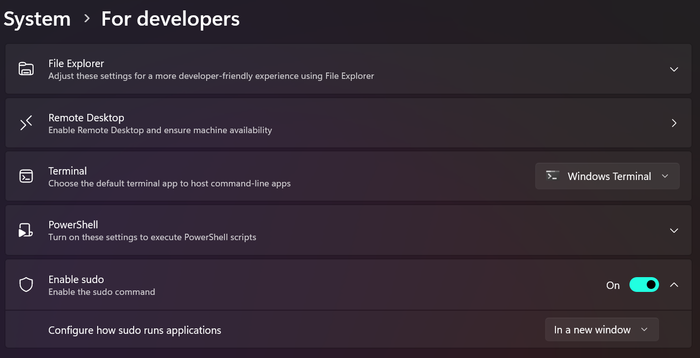

## Run a command recursivelly using the PowerShell:

```
dir *.* | foreach-object { $newname = $_.Name.Remove($_.Name.Length - $_.Extension.Length) + ".mp4"; .\ffmpeg.exe -i "$_"  $newname }

```
Some properties in the returning variable are: $_.Name, $_.BaseName, $_.FullName.

## Creating hardlinks in Windows

``` bash
fsutil hardlink create <newfilename> <existingfilename>
fsutil hardlink list <filename>
```

## Restart the Ubuntu subsystem without restarting the Windows

```
#see what is running
wsl -l -v

#shutdown everything
wsl --shutdown

#start the distro
wsl -d <DistroName>
```
## Enabling sudo for windows

Activate sudo in Windows Settings:



* Maybe you'll need to `Install-Module -Name Sudo -Scope CurrentUser`

Then, open PowerShell and run:

`sudo config --enable <configuration_option>`
And `<configuration_option>` can be:  disable, enable, forceNewWindow, disableInput, normal, default


And then, test if it works:
`sudo help`


## Bitlocker
Unlock:

`sudo manage-bde -unlock F:`

`sudo manage-bde -lock F:`
